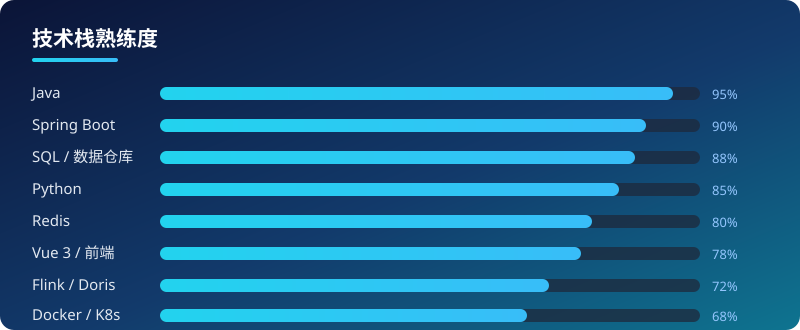

<!--
  Ruffianjiang 的 GitHub 个人主页 README
  - Banner 为仓库自托管 SVG（assets/header.svg），经由 raw.githubusercontent.com 加载。
    国内(中国大陆)若 raw.githubusercontent.com 访问不稳定，可将 SVG 改为可访问图床地址，
    或把  替换为国内可访问的镜像链接；其余徽章/文本不受影响。
  - 技术栈 / 数据徽章均使用 shields.io（相对更稳定），不依赖 Vercel 等海外 CDN。
  - 已移除 github-readme-stats 卡片：实测返回 HTTP 503，会渲染成破图。
  - 自托管资源：assets/header.svg（横幅）、assets/skills.svg（技能条），
    均由本仓库经 raw.githubusercontent.com 提供，不依赖第三方图床。
-->

  

<h1 align="center">👋 你好，我是 Ruffianjiang</h1>

  <b>全栈工程师 · 技术管理者</b> 
  长期深耕 <b>工业智能平台</b> 与 <b>大数据 / 实时计算</b> 领域，
  关注 <b>云原生</b> 与 <b>工程效能</b> 提升。

  
  
  

---

## 🧰 技术栈

  
  
  
  
  
  
  
  
  

  

---

## 🔭 当前在做

- 🛡️ **分布式系统 · 高并发架构** —— Redis Stream 消息队列、服务治理与稳定性实践
- 📊 **数据平台与实时计算** —— Flink / Doris 离线-实时融合与指标分析
- 🕸️ **数据可视化与前端工程** —— Vue 3 / AntV G6 大屏与关系图谱
- 🤖 **大模型工程落地** —— 在工程研发与团队协作中引入 LLM 提效

---

## 🚀 精选项目

<table>
  <tr>
    <td width="50%" align="center">
      <a href="https://github.com/Ruffianjiang/DataX"><b>🟡 DataX</b></a> <i>fork</i> 
      阿里大数据同步引擎，学习 + 二次开发 
      
    </td>
    <td width="50%" align="center">
      <a href="https://github.com/Ruffianjiang/flink-learning"><b>🟢 flink-learning</b></a> <i>fork</i> 
      Flink 实时计算学习仓库 
      
    </td>
  </tr>
  <tr>
    <td width="50%" align="center">
      <a href="https://github.com/Ruffianjiang/x-springboot-web"><b>🔵 x-springboot-web</b></a> 
      Spring Boot 3 + Vue 全栈实战 
      
    </td>
    <td width="50%" align="center">
      <a href="https://github.com/Ruffianjiang/java4fun"><b>☕ java4fun</b></a> 
      Java 小工具 / 实践集合 
      
    </td>
  </tr>
  <tr>
    <td width="50%" align="center">
      <a href="https://ruffianjiang.github.io"><b>📝 ruffianjiang.github.io</b></a> 
      技术博客（Hexo） 
      
    </td>
    <td width="50%" align="center">
      <a href="https://github.com/Ruffianjiang/dubbo-start"><b>🔒 dubbo-start</b></a> <i>private</i> 
      基于 Dubbo 的微服务脚手架，含前后端工程与依赖治理实践 
      
    </td>
  </tr>
</table>

> 注：部分企业项目为私有仓库，未在本账号展示。Star 数为 shields.io 动态获取，随仓库实时变化。

---

## 📊 GitHub 数据

  
  
  

  
  

<!--
  注：原 github-readme-stats 卡片（Vercel 托管）已移除。
  实测该服务返回 HTTP 503（服务本身不可用，非仅国内网络问题），会渲染成破图；
  且打字机动画、访客计数器、贡献热力图等同类组件均依赖 Vercel / 海外 CDN，
  国内加载失败率高，故一律不采用。以上 shields.io 徽章实测可达，作为数据来源。
-->

---

## 📫 联系方式

- 🌐 技术博客：<https://ruffianjiang.github.io>
- 📧 邮箱：`jiangyj0516@outlook.com`
- 🐙 GitHub：[@Ruffianjiang](https://github.com/Ruffianjiang)

---

  ⚡ 用代码守护工业系统的安全与智能 ⚡

